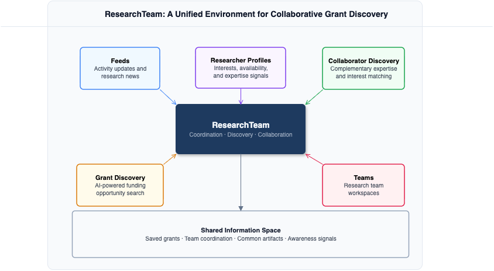
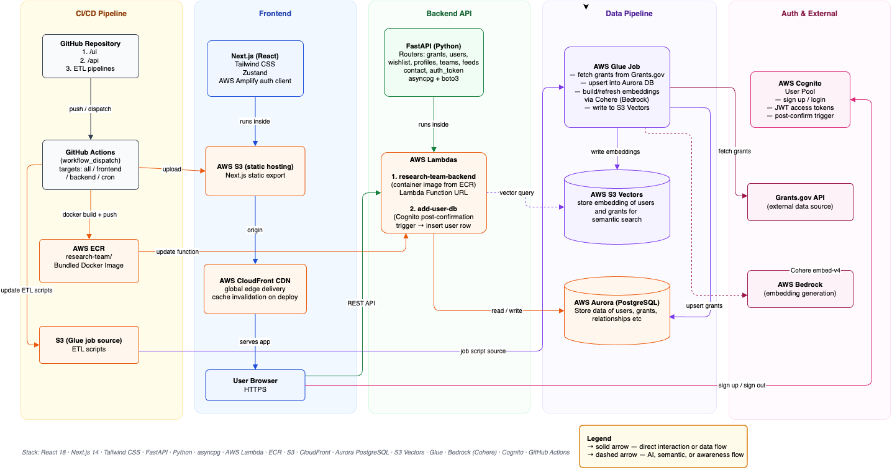

# ResearchTeam

[](https://github.com/research-team-lab/research-team/actions)
[](CONTRIBUTING.md)

Platform for research team formation — combines grant discovery, researcher profiles, and AI-powered collaboration matching.

**Live:** [https://research.team](https://research.team)
**Contact:** [research.team.app@gmail.com](mailto:research.team.app@gmail.com)

## Components

| Directory    | Description                 | README                                     |
| ------------ | --------------------------- | ------------------------------------------ |
| `ui/`        | Next.js 14 frontend         | [ui/README.md](ui/README.md)               |
| `api/`       | FastAPI backend (Lambda)    | [api/README.md](api/README.md)             |
| `crons/`     | Grants data pipeline (Glue) | [crons/README.md](crons/README.md)         |
| `terraform/` | AWS infrastructure          | [terraform/README.md](terraform/README.md) |

## Stack

| Layer         | Technology                                        |
| ------------- | ------------------------------------------------- |
| Frontend      | Next.js 14 · Tailwind CSS · React Query · Zustand |
| Backend       | FastAPI · Python · asyncpg                        |
| Auth          | AWS Cognito (email + Google)                      |
| Hosting       | S3 + CloudFront · Lambda via ECR                  |
| Database      | AWS Aurora DSQL (PostgreSQL)                      |
| Vector Search | AWS S3 Vectors · Cohere embed-v4 (Bedrock)        |
| Data Pipeline | AWS Glue · Grants.gov API                         |
| CI/CD         | GitHub Actions                                    |

## Architecture

### High-Level Architecture



### Technical Architecture



## Local Development

No AWS account needed. Docker Compose starts a local PostgreSQL database and runs the full stack.

```bash
docker compose up
```

| Service     | URL                     |
| ----------- | ----------------------- |
| Frontend    | <http://localhost:3000> |
| Backend API | <http://localhost:8080> |
| PostgreSQL  | localhost:5432          |

The database schema is applied automatically on first start from [`schema.sql`](schema.sql). To reset the database:

```bash
docker compose down -v && docker compose up
```

**What works locally:** all API routes, user profiles, grants browsing, groups, messaging, feed.

**What requires AWS:** AI semantic search (Bedrock embeddings + S3 Vectors) and auth (Cognito). These degrade gracefully — AI search returns empty results and auth is disabled when `COGNITO_USER_POOL_ID` is not set.

See [CONTRIBUTING.md](CONTRIBUTING.md) for running each service individually without Docker.

## Deploy

All deployments are via GitHub Actions — trigger manually from the Actions tab with target `frontend`, `backend`, `cron`, or `all`.

## Contributing

We welcome contributions! Please read [CONTRIBUTING.md](CONTRIBUTING.md) for the full pull request process and setup guide.

Before opening a PR, make sure all checks pass for the components you changed:

| Component | Commands                                                               |
| --------- | ---------------------------------------------------------------------- |
| `ui/`     | `npm run lint` · `npx tsc --noEmit` · `npm test`                       |
| `api/`    | `ruff check .` · `ruff format --check .` · `pyright` · `uv run pytest` |
| `crons/`  | `ruff check .` · `ruff format --check .` · `uv run pytest`             |

To report a security vulnerability, see [SECURITY.md](SECURITY.md) — do not open a public issue.

## License

Copyright (c) 2024 ResearchTeam Contributors.
